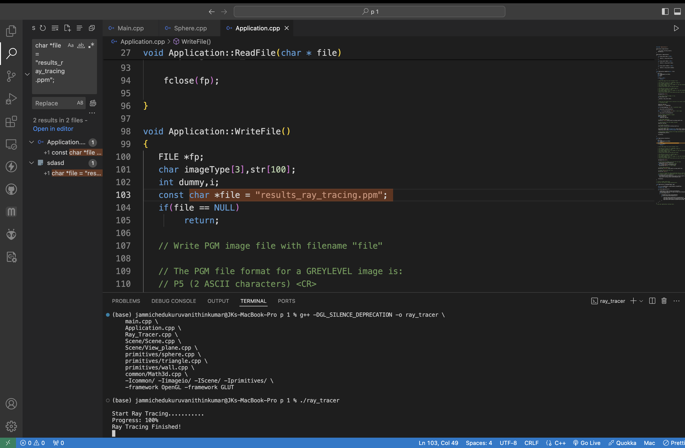

<!DOCTYPE html>
<html lang="en">
<head>
    <meta charset="UTF-8">
    <meta name="viewport" content="width=device-width, initial-scale=1.0">
    <title>Advanced Computer Graphics - Project 1</title>
    <link href="https://fonts.googleapis.com/css2?family=Roboto+Mono:wght@400;700&display=swap" rel="stylesheet">
    
</head>
<body>

<h1>Advanced Computer Graphics - Project 1</h1>

<h2>📚 Overview</h2>

This project implements a basic ray tracer that utilizes local shading with <strong>Phong shading</strong> techniques to render a 3D virtual scene. The goal is to showcase smooth shading effects on multiple objects, such as spheres and walls, enhancing the visual realism of the scene.

<h2>HOW TO EXECUTE</h2>

<h3>Prerequisites</h3>
<ul>
    <li>Ensure you have the necessary libraries installed, including OpenGL and GLUT.</li>
    <li>As I am using macOS, you may need to install Homebrew and use it to install these libraries.</li>
</ul>

<h3>Compilation Steps</h3>
<ol>
    <li>Open your terminal and navigate to the project directory.</li>
    <li>Use the following command to compile the code:</li>
    <pre><code>g++ -DGL_SILENCE_DEPRECATION -o ray_tracer \
        main.cpp \
        Application.cpp \
        Ray_Tracer.cpp \
        Scene/Scene.cpp \
        Scene/View_plane.cpp \
        primitives/sphere.cpp \
        primitives/triangle.cpp \
        primitives/wall.cpp \
        common/Math3d.cpp \
        -Icommon/ -Iimageio/ -IScene/ -Iprimitives/ \
        -framework OpenGL -framework GLUT
    </code></pre>
    <li>After successful compilation, run the program with:</li>
    <pre><code>./ray_tracer</code></pre>
</ol>

<h2>Execution Screenshot:</h2>

<h2>Output Image:</h2>

</body>
</html>
