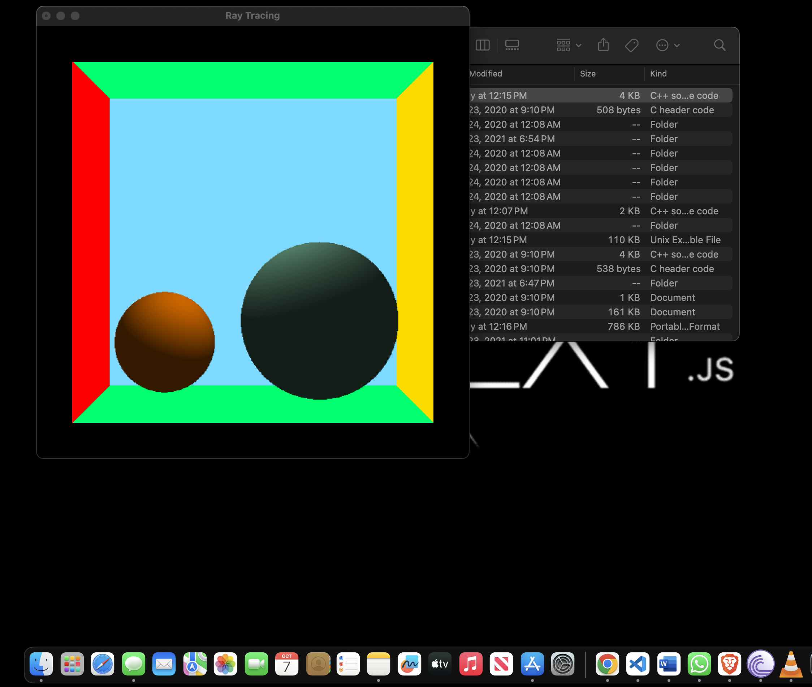

# Advanced Computer Graphics - Project 1

Output_Image:

Execution Screenshot:

![Execution_screenshot] (assets/execution_screenshot.png)

## 📚 Overview

This project implements a basic ray tracer that utilizes local shading with **Phong shading** techniques to render a 3D virtual scene. The goal is to showcase smooth shading effects on multiple objects, such as spheres and walls, enhancing the visual realism of the scene.

## 🗂️ Project Structure
